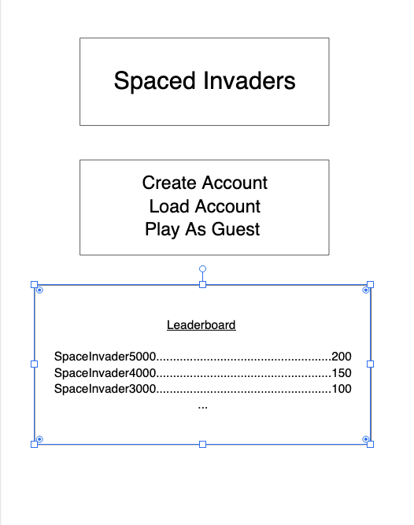

# Web Dev Starter Code

## Project Spec

For the final project, I will be building a space invaders clone. I plan on building this from scratch as best as I'm able, using official documentation as the sole resource despite the myriad tutorials available, as I am especially wanting to spend more time practicing with javascript to build those skills.  

The main landing page will have options to create an account, load a saved account, or begin a new game as a guest (ie, without creating an account).  It will also display leaderboard stats that will be pulled from the database.  Should the user choose to create/load an account, they will be taken to a second page, which will have (probably relatively limited) personalization options, and the ability to load a save game or begin a new game that can be saved in some fashion.  Once a new game is selected, either as an account holding user, or guest, they will be taken to another page to allow for game options.  These options will include difficulty level, which will consist of the number of aliens, how quickly they move, how fast they fire and how many aliens are firing at a time, and maybe other elements as i work through this and sort out what seems reasonable/acheivable.  I would also like to have the ability to choose the color scheme, with at a minimum a light/dark option, but I'd also like to include a few themed color schemes (for instance, given it's spring, perhaps a pastel scheme).  I would also like the option to select different style of aliens.  This may be connected to the varying color schemes (spring again - rabbit aliens?), or maybe just a collection that the user can pick from as they see fit.  Once the user has selected the varying options, they'll be taken to another page where the game will begin. 

The target audience for this will be the general public since it will just be a standard video game. The data to manage will be individual user data, including username/password and saved games, as well as leaderboard info with saved scores/usernames to be displayed on the main landing page. I think I will probably add some kind of a commenting/messaging component as well, but haven't yet thought through what that will look like.  

As a stretch goal, I'd like to make this functional on mobile devices as well, perhaps creating the ability to select (or auto select?) the device being used to play the game, and adjust the mechanism of control accordingly to better suit available controls and playability.  As an even further stretch, perhaps sorting out how to use a phones accelerometer to operate the game, maybe even taking in audio input for the firing (I have it in my head that you operate the game by steering the phone with two hands, while saying "pew pew" when you want to fire. I'm imagining this will be pretty complicated to pull off, but haven't looked into it at all yet, so I'm hoping it's relatively approachable and I can get it to work).

## Project Wireframe

TODO: Replace the wireframe below with you own design.

